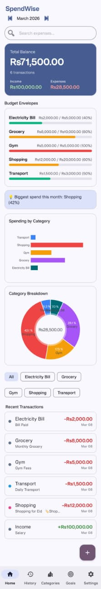
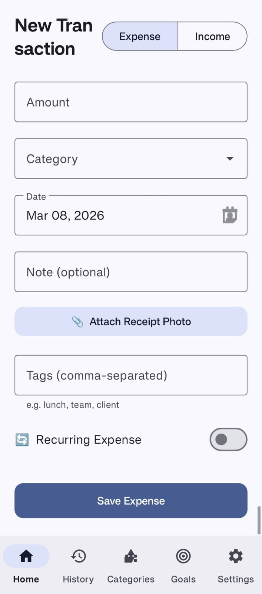
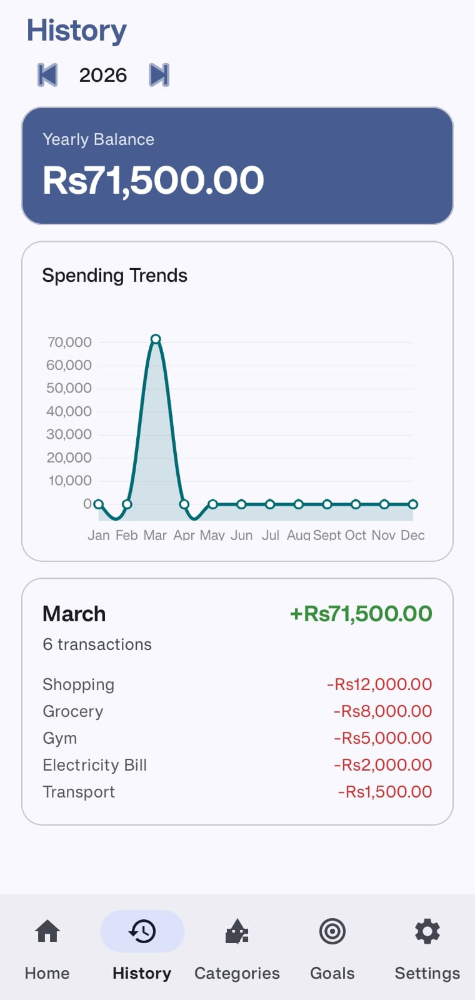
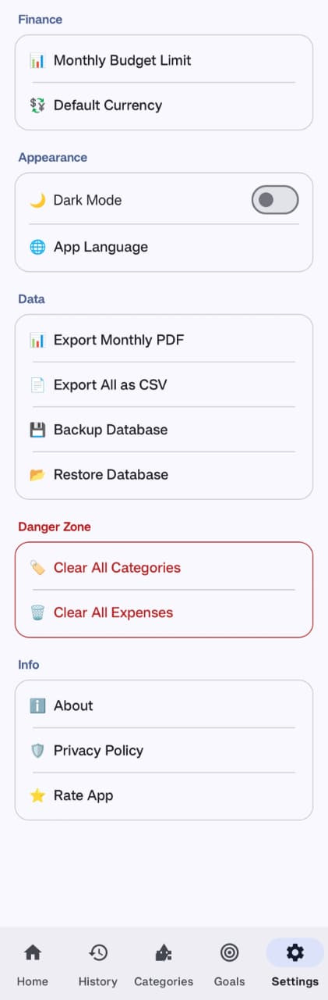

# SpendWise 💰
**Smart. Secure. Simple.**  
*Your personal finance companion in the pocket.*

    

---

## 📱 Overview
**SpendWise** is a modern, offline-first Android expense tracker built to give users complete control over their financial data. Designed with the latest **Material Design 3** guidelines, it offers a seamless and aesthetically pleasing user experience without ensuring any data leaves the device.

Whether you're tracking daily coffee runs, managing monthly bills, or splitting costs with friends, SpendWise makes it effortless.

---

## 📷 Screenshots
| Dashboard | Add Expense | Monthly Analysis | Settings |
|:---:|:---:|:---:|:---:|
|  |  |  |  |

---

## ✨ Key Features

### Core Functionality
- **💸 Expense Tracking**: Quickly add, edit, and delete daily expenses.
- **📊 Interactive Dashboard**: Visualize monthly spending with beautiful bar charts and summaries.
- **📂 Category Management**: Create and manage custom categories with colorful icons.
- **📅 Smart Filtering**: Filter transaction history by date range or specific categories.
- **🔍 Search & History**: View detailed transaction logs with swipe-to-delete gestures.

### Advanced Tools
- **💰 Split Expenses**: Easily divide bills among friends or groups and track who owes what.
- **🎯 Savings Goals**: Set financial targets and track your progress visually.
- **🔄 Recurring Transactions**: Automate regular payments like rent or subscriptions.
- **🔒 Secure Login**: Protect your data with a local PIN-based authentication system.
- **🌑 Offline First**: No internet required. Your data stays on your device, always.
- **⚙️ Customization**: Native Light Theme support with dynamic colors.

---

## 🛠 Tech Stack
This project adheres to modern Android development best practices.

*   **Language**: [Kotlin](https://kotlinlang.org/)
*   **Architecture**: MVVM (Model-View-ViewModel)
*   **UI Framework**: XML with [Material Components 3](https://m3.material.io/)
*   **Asynchronous**: [Coroutines](https://github.com/Kotlin/kotlinx.coroutines) & Flow
*   **Dependency Injection**: Manual / ViewModelFactory
*   **Local Database**: [Room Persistence Library](https://developer.android.com/training/data-storage/room)
*   **Navigation**: [Jetpack Navigation Component](https://developer.android.com/guide/navigation)
*   **Charting**: [MPAndroidChart](https://github.com/PhilJay/MPAndroidChart)

---

## 🏗 Architecture
SpendWise follows the **MVVM (Model-View-ViewModel)** architectural pattern to ensure separation of concerns and testability.

*   **Model (Data Layer)**:
    *   **Room Database**: The single source of truth for all data.
    *   **Repository**: Mediates between the ViewModel and the Database.
    *   **DAO (Data Access Object)**: Defines database interactions.
*   **ViewModel**:
    *   Holds UI state and survives configuration changes.
    *   Exposes data to the View via `LiveData`/`Flow`.
*   **View (UI Layer)**:
    *   **Fragments**: Observe the ViewModel and update the UI accordingly.
    *   **XML Layouts**: Define the visual structure.

---

## 📂 Project Structure
```
com.example.spendwise
├── data                  # Data layer (Room entities, DAOs, Repo)
│   ├── AppDatabase.kt
│   ├── Expense.kt
│   ├── ExpenseDao.kt
│   ├── ExpenseRepository.kt
│   └── ...
├── ui                    # UI layer (Fragments, ViewModels, Adapters)
│   ├── fragments         # All app screens (Home, AddExpense, History, etc.)
│   ├── viewmodel         # Shared ViewModels
│   └── SpendWiseApp.kt   # Application class
├── MainActivity.kt       # Single Activity container
└── utils                 # Helper classes and extensions
```

---

## 🗄 Database Design
The app uses a relational database structure powered by Room.

*   **Expense Entity**: Stores transaction amount, date, description, and category ID.
*   **Category Entity**: Stores category names, icons, and colors.
*   **RecurringExpense**: Definitions for automated transaction creation.
*   **SavingsGoal**: Tracks target amounts and current progress.
*   **SplitGroup / SplitMember**: Relational tables for managing shared expenses.

---

## 🎨 UI & Design Principles
*   **Material Design 3**: Utilizes the latest Android design language for a cohesive look.
*   **Single Activity Architecture**: Uses one `MainActivity` hosting multiple `Fragments`.
*   **Responsive**: Layouts adapt to different screen sizes and orientations.
*   **Accessibility**: High contrast colors and properly labeled elements.

---

## 🚀 How to Build & Run
1.  **Clone the Repository**:
    ```bash
    git clone https://github.com/chsaad-dev/SpendWise.git
    ```
2.  **Open in Android Studio**:
    *   Select `File > Open` and choose the project directory.
    *   Let Gradle sync complete.
3.  **Build the Project**:
    *   Go to `Build > Make Project` (Ctrl+F9).
4.  **Run on Device/Emulator**:
    *   Connect an Android device via USB or start an emulator.
    *   Click `Run` (Shift+F10).

---

## ✅ Requirements
*   **Android Studio**: Iguana (2023.2.1) or newer recommended.
*   **Android SDK**: API Level 34 (UpsideDownCake).
*   **Min SDK**: API Level 24 (Android 7.0 Nougat).
*   **JDK**: Java 17 or higher.

---

## 🔮 Future Improvements
*   [ ] **Biometric Authentication**: Fingerprint unlock for faster access.
*   [ ] **Dark Mode Support**: Full system-wide dark theme implementation.
*   [ ] **Cloud Backup**: Optional Google Drive sync for data redundancy.
*   [ ] **Export to CSV/PDF**: Generate monthly reports for external use.
*   [ ] **Multi-Currency Support**: Real-time currency conversion APIs.

---

## 📄 License
This project is licensed under the [MIT License](LICENSE).

---

## 👨‍💻 Author
**Android Developer**  
*Passionate about building clean, efficient, and user-friendly mobile applications.*

[GitHub](https://github.com/chsaad-dev) | [LinkedIn]([https://linkedin.com/](https://www.linkedin.com/in/muhammad-saad-a45929202?)
